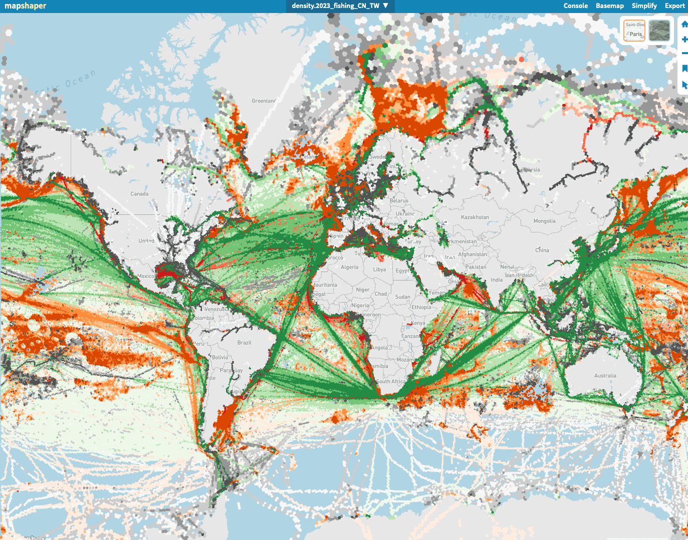

# duckdb-mapshaper

List of tools and resources for working with DuckDB and Mapshaper. SQL scripts allows to manipulate ship density data and flag by H3 cells. Then, the data can be exported to a GeoJSON file and displayed on a map using Mapshaper.

## DBeaver
Tool for database management and SQL queries, compatible with DuckDB.

## Parquet file
Parquet is a file format that provides efficient data compression and encoding schemes with enhanced performance to handle complex data in bulk (compared to CSV or JSON files for example).

It can be read easily by DuckDB.

```sql
SELECT * FROM 'file.parquet';

-- Example of result
H3Index           |Flag|ShipType  |nb    |
------------------+----+----------+------+
594496153202982911|NO  |fishing   |299568|
594495131000766463|NO  |fishing   |298407|
594496093073440767|NO  |fishing   |241015|
594495113820897279|NO  |fishing   |212447|
594495088051093503|NO  |          |169092|
594495088051093503|NO  |fishing   |164818|
594496153202982911|NO  |          |162352|
594494959202074623|NO  |fishing   |156293|
594495319979327487|NO  |cargo     |  4156|
594495191130308607|IS  |fishing   |  4150|
594498343636303871|SE  |cargo     |  4147|
594477813692628991|FO  |fishing   |  4146|
594496479620497407|RU  |tanker    |  4127|
594493138135941119|NO  |fishing   |  4125|
594498343636303871|CK  |other     |  4124|
594493146725875711|NO  |fishing   |  4121|
```

## DuckDB
Fast SQL database management system. 

- To use spatial and H3 functions, you need to install theses extensions :

```sql
INSTALL H3 FROM community;
FORCE INSTALL SPATIAL FROM 'http://nightly-extensions.duckdb.org';

LOAD H3;
LOAD SPATIAL ;
```

- To set the path from where Parquet files are read :

```sql
SET file_search_path = '/absolute/path/from/where/parquet/files/are/read';

SELECT * FROM 'file.parquet'; -- relative path
```

- To use the coordinates of a H3 cell feature, you can use the following command (for export to GeoJSON for example) :

```sql
... h3_cell_to_boundary_wkt(H3Index).st_geomfromtext() ...
```

- To manage anti-meridian, you can choose an interval for the longitude values :
    
```sql
-- Code snippet to manage anti-meridian

... h3_h3_to_string(H3Index) AS h3 ... -- convert into a H3 string

... h3_cell_to_lng(h3) AS lng ... -- get the longitude value from the H3 string

... lng > -179 AND lng < 179 ... -- filter the longitude values between -177 and 177

```

- To export a table to a GeoJSON file, you can use the following command :

```sql
COPY table_name
TO 'file.json'
WITH (FORMAT GDAL, DRIVER 'GeoJSON');
```

## Mapshaper

https://mapshaper.org/

Tool for editing and converting shapefiles, GeoJSON ... and displaying them on a map.

A command line tool is also available in the interface.

#### Examples of command line usage
```bash
# Set stroke and fill colors for the features
classify field=ShipType colors="random" \
style stroke=grey

classify field=ShipType colors="#83bcb6AA,#4c78a8AA,#f58518AA,#f2cf5bAA,#9ecae9AA,#54a24bAA,#d6a5c9AA" \
style stroke=d.fill

# Merge layers
--merge-layers target='layer1,layer2'

# Dissolve all features into a single feature by a common field
dissolve stroke
```


